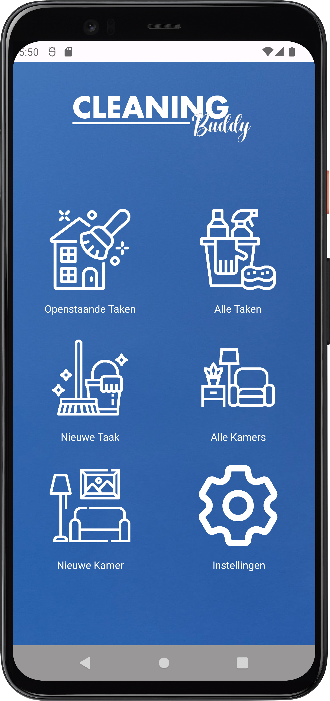
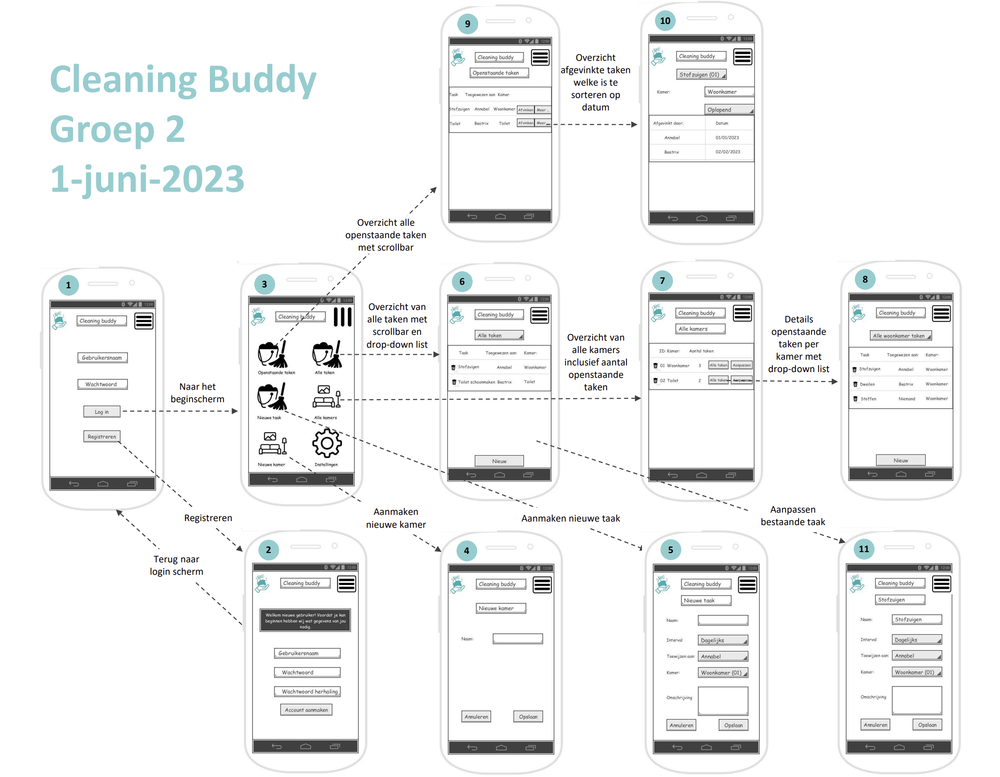

# Cleaning Buddy

Cleaning Buddy is een applicatie die is ontworpen om je schoonmaakroutine te vereenvoudigen. 
Het stelt je in staat om schoonmaaktaken voor elke kamer in je huis aan te maken en hun schoonmaakintervallen in te stellen. 
Of je nu je keuken wilt dweilen of de woonkamer wilt stofzuigen, Cleaning Buddy helpt je daarbij. 
Geen vergeten schoonmaaktaken meer voor jou en je huisgenoten.

## Functionaliteiten:

### Kamers:
Maak kamers aan, wijzig ze en verwijder ze binnen de app.
Elke kamer heeft een uniek ID en een naam.
De app toont een lijst met kamers, inclusief ID, naam en het aantal toegewezen taken.
Door op een kamer te klikken, krijg je een lijst te zien van alle toegewezen schoonmaaktaken voor die kamer.

### Schoonmaaktaken:
Maak schoonmaaktaken aan met een uniek ID, naam, interval en optionele beschrijving.
Kies uit standaardintervallen zoals dagelijks of wekelijks, of stel een aangepast interval in (bijv. elke 90 dagen).
Wijs taken toe aan specifieke kamers en optioneel aan gebruikers.
Valideer verplichte taakgegevens bij het aanmaken, waarbij de gebruiker wordt gevraagd ontbrekende informatie aan te vullen.

### Taakbeheer:
Bekijk een overzicht van alle openstaande taken binnen de app.
Markeer taken als voltooid, waardoor ze uit de lijst verdwijnen.
De app registreert de voltooiingsdatum en de gebruiker die de taak heeft gemarkeerd.
Taken verschijnen weer in de lijst op basis van het ingestelde interval.
Bekijk een uitgebreide lijst van alle schoonmaaktaken, inclusief voltooiingsdatums en verantwoordelijke huisgenoten.

### Gebruikersbeheer:
Gebruikers kunnen zich registreren in de app met een unieke gebruikersnaam en wachtwoord.
Automatische toewijzing van een uniek ID aan geregistreerde gebruikers.
Gebruikers kunnen inloggen in de app en een persoonlijk overzicht bekijken van openstaande taken die aan hen zijn toegewezen of niet-toegewezen taken.
Gebruikers kunnen taken aan zichzelf toewijzen of aan hun huisgenoten.
Er zijn geen vooraf gedefinieerde rollen in de app, maar de taaktoewijzing wordt bijgehouden voor verantwoordelijkheid.
De app hanteert wachtwoordsterkte en dubbele invoer tijdens het registratieproces om typfouten te voorkomen.
Elke gebruikersnaam binnen de app moet uniek zijn.

### Wireframes:
